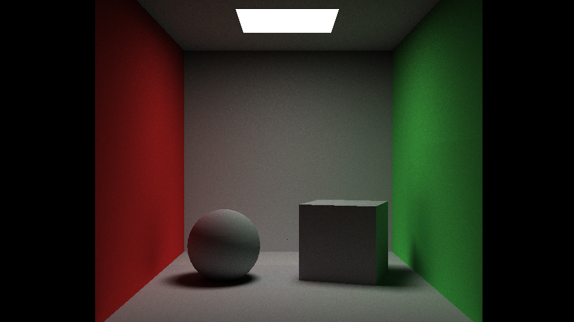

# pathTracer

This is an experimental uni-directionnal path tracer based on USD.  




## Features
- Diffuse shading
- Rect lights
- Smooth shading
- BVH acceleration
- Multi-threaded
- CPU based
- USD as scene data source 


## Usage
```shell
pathTracer <scene.usda>
```

```shell
pathTracer examples/cornell.usda
```

## Dependencies
- USD
- Eigen
- Png

## Sources
- USD cookbook: https://github.com/ColinKennedy/USD-Cookbook
- Path tracer using USD: https://github.com/JoshuaSenouf/tracer
- Path tracer topics: https://www.scratchapixel.com/
- Aera Light algorithm: http://raytracerchallenge.com/bonus/area-light.html
- Acceleration structure: https://jacco.ompf2.com/2022/04/13/how-to-build-a-bvh-part-1-basics/
